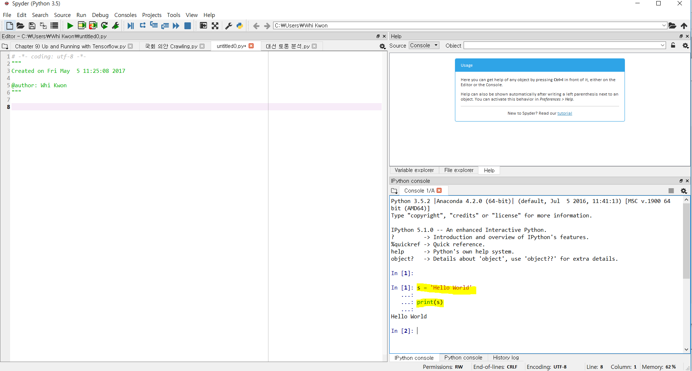
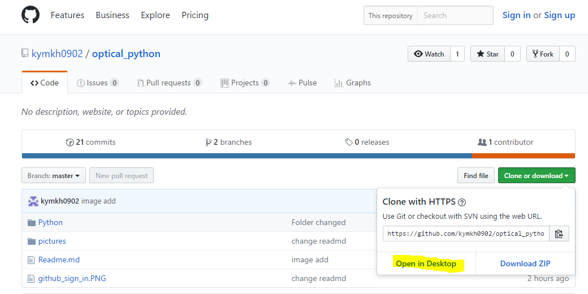

# Python/GitHub 설치 및 강의 계획

# 1. Python

### - Anaconda 다운로드 및 설치 진행
(https://repo.continuum.io/archive/Anaconda3-4.2.0-Windows-x86.exe)

- 설치 경로 : **Cloud PC 내** C:\anaconda 경로에 설치

- 설치 시에 아래 그림에 맞게 모두 클릭해주면 됩니다.         
<a href="url"></a> <a href="url"></a> 

### - 실행 확인
- 설치 완료 후에 윈도우 검색 창에서 ***Jupyter Notebook, Spyder*** 실행한 후에 아래 내용을 입/출력해봅니다. 
	
```python
s = "Hello World"
print(s)
```
 1) Jupyter 예제(입력 후 Shift + Enter)


 2) Spyder 예제(오른쪽 창에 입력 후 Enter)




- 출력이 잘 된다면 설치가 완료된 것입니다. 수업 진행 시 Jupyter를 사용할 것이고 이 후에 각자 사용하실 땐 Spyder가 편리하실 겁니다.


# 2. GitHub 


### - GitHub 다운로드 및 설치 진행. 
   (https://github-windows.s3.amazonaws.com/GitHubSetup.exe)

- 위 링크에서 받아서 로컬에 설치해주시면 됩니다. 설치가 다 되면 Github, Git Shell 아이콘이 생성될 것입니다.


- 이제 Github에 계정을 만들어 봅시다.(https://github.com) 홈페이지에 접속해서 회원가입을 합니다.  


- 수업 홈페이지에 접속해서 각자 컴퓨터에 Clone(파일을 내 컴퓨터에 복사하는 과정)합니다.
(https://github.com/kymkh0902/optical_python/)

- 아래와 같이 Clone - Open in Desktop 누르시면 GitHub가 켜지면서 저장 경로가 뜰 겁니다. 경로는 Secure Folder\Github에 저장해주세요. 




# 3. 강의 순서

1) 기본 설치 확인 및 Git 사용법 학습
	- 학습 및 활용 방안 Guide 제시 

2) Python 기본 문법 학습 
  	- Learn python the hard way라는 교재 내용을 바탕으로 진행할 예정입니다. 추가 학습 필요 시 아래 링크 참조
          (https://learnpythonthehardway.org/book/)
	- Byte of Python 이라는 책도 좋아합니다. 
	  (http://byteofpython-korean.sourceforge.net/byte_of_python.pdf)

3) 데이터 분석을 위한 Library 학습(pandas)

4) 머신러닝 간략 소개 

- 각 강의 별 학습 자료 및 방법 지속 업데이트 예정. 
